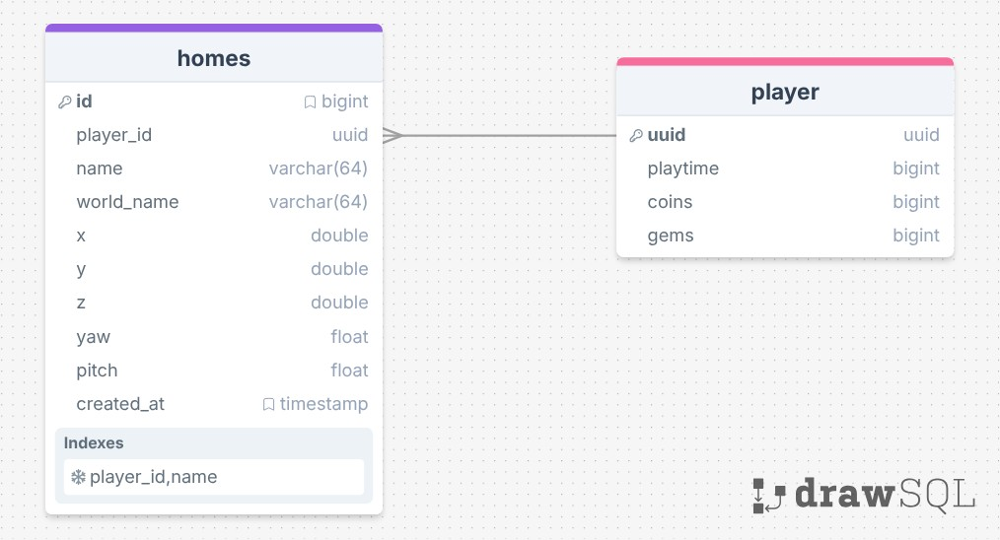

# Datenbankschema

## Schema-Grafik

---
 

## Überblick

| Bereich   | Beschreibung                                                |
|-----------|-------------------------------------------------------------|
| `player`  | Enthält die Basisdaten eines Spielers.                      |
| `homes`   | Speichert benannte Homes eines Spielers inklusive Position. |
| Beziehung | Ein Spieler kann mehrere Homes besitzen.                    |

Das Schema besteht aus einer klaren `1:n`-Beziehung.

---

## Tabellen

### `player`

Die Tabelle `player` bildet die zentralen Stammdaten eines Spielers ab.

| Spalte     | Typ      | Zweck                        |
|------------|----------|------------------------------|
| `uuid`     | `uuid`   | Primärschlüssel des Spielers |
| `playtime` | `bigint` | Gesammelte Spielzeit         |
| `coins`    | `bigint` | Aktueller Coin-Stand         |
| `gems`     | `bigint` | Aktueller Gem-Stand          |

### `homes`

Die Tabelle `homes` speichert feste Teleport-Ziele eines Spielers.

| Spalte       | Typ           | Zweck                                     |
|--------------|---------------|-------------------------------------------|
| `id`         | `bigint`      | Primärschlüssel des Home-Eintrags         |
| `player_id`  | `uuid`        | Referenz auf den Spieler in `player.uuid` |
| `name`       | `varchar(64)` | Frei wählbarer Name des Homes             |
| `world_name` | `varchar(64)` | Welt oder Dimension des Homes             |
| `x`          | `double`      | X-Koordinate                              |
| `y`          | `double`      | Y-Koordinate                              |
| `z`          | `double`      | Z-Koordinate                              |
| `yaw`        | `float`       | Horizontale Blickrichtung                 |
| `pitch`      | `float`       | Vertikale Blickrichtung                   |
| `created_at` | `timestamp`   | Erstellungszeitpunkt des Homes            |

---

## Beziehungen

| Von               | Nach          | Typ             | Bedeutung                                |
|-------------------|---------------|-----------------|------------------------------------------|
| `homes.player_id` | `player.uuid` | Fremdschlüssel  | Ordnet jedes Home genau einem Spieler zu |

---

## Indizes

| Tabelle   | Index               | Typ        | Bedeutung                                  |
|-----------|---------------------|------------|--------------------------------------------|
| `homes`   | `player_id, name`   | eindeutig  | Verhindert doppelte Home-Namen pro Spieler |
