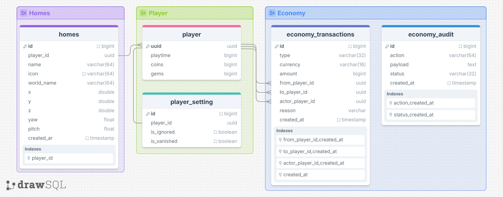

# Datenbankschema

## Schema-Grafik

---

## Überblick

| Bereich                | Beschreibung                                                                   |
|------------------------|--------------------------------------------------------------------------------|
| `player`               | Enthält die Basisdaten eines Spielers.                                         |
| `player_setting`       | Enthält Flags des Spieler                                                      |
| `homes`                | Speichert benannte Homes eines Spielers inklusive Position.                    |
| `economy_transactions` | Speichert Economy-Vorgänge wie Transfers und Admin-Änderungen.                 |
| `economy_audit`        | Speichert Audit-Einträge zu Economy-Aktionen.                                  |
| Beziehungen            | Ein Spieler kann mehrere Homes besitzen und in vielen Transaktionen vorkommen. |

Das Schema basiert auf mehreren `1:n`-Beziehungen über `player.uuid`.

---

## Tabellen

### `player`

Die Tabelle `player` bildet die zentralen Stammdaten eines Spielers ab.

| Spalte     | Typ               | Zweck                        |
|------------|-------------------|------------------------------|
| `uuid`     | `uuid`            | Primärschlüssel des Spielers |
| `playtime` | `bigint`          | Gesammelte Spielzeit         |
| `coins`    | `bigint unsigned` | Aktueller Coin-Stand         |
| `gems`     | `bigint unsigned` | Aktueller Gem-Stand          |

### `player_setting`

Die Tabelle `player_setting` speichert Flags des Spielers.

| Spalte        | Typ       | Zweck                                     |
|---------------|-----------|-------------------------------------------|
| `id`          | `bigint`  | Primärschlüssel des Flag-Eintrags         |
| `player_id`   | `uuid`    | Referent auf den Spieler in `player.uuid` |
| `is_ignored`  | `boolean` | Flag, ob der Spieler im Ignore-Modus ist  |
| `is_vanished` | `boolean` | Flag, ob der Spieler im Vanish-Modus ist  |

### `homes`

Die Tabelle `homes` speichert feste Teleport-Ziele eines Spielers.

| Spalte       | Typ           | Zweck                                               |
|--------------|---------------|-----------------------------------------------------|
| `id`         | `bigint`      | Primärschlüssel des Home-Eintrags                   |
| `player_id`  | `uuid`        | Referenz auf den Spieler in `player.uuid`           |
| `name`       | `varchar(64)` | Frei wählbarer Name des Homes                       |
| `icon`       | `varchar(64)` | Material-Icon des Homes (`GRASS_BLOCK` als Default) |
| `world_name` | `varchar(64)` | Welt oder Dimension des Homes                       |
| `x`          | `double`      | X-Koordinate                                        |
| `y`          | `double`      | Y-Koordinate                                        |
| `z`          | `double`      | Z-Koordinate                                        |
| `yaw`        | `float`       | Horizontale Blickrichtung                           |
| `pitch`      | `float`       | Vertikale Blickrichtung                             |
| `created_at` | `timestamp`   | Erstellungszeitpunkt des Homes                      |

### `economy_transactions`

Die Tabelle `economy_transactions` protokolliert fachliche Geldbewegungen.

| Spalte            | Typ            | Zweck                                                     |
|-------------------|----------------|-----------------------------------------------------------|
| `id`              | `bigint`       | Primärschlüssel des Transaktionseintrags                  |
| `type`            | `varchar(32)`  | Transaktionstyp (z. B. `PAY`, `ADMIN_GIVE`, `ADMIN_TAKE`) |
| `currency`        | `varchar(16)`  | Betroffene Währung (`coins`, `gems`)                      |
| `amount`          | `bigint`       | Betrag der Transaktion                                    |
| `from_player_id`  | `uuid`         | Optionaler Absender (`player.uuid`)                       |
| `to_player_id`    | `uuid`         | Optionaler Empfänger (`player.uuid`)                      |
| `actor_player_id` | `uuid`         | Optionaler Auslöser (`player.uuid`)                       |
| `reason`          | `varchar(255)` | Fachlicher Grund der Buchung                              |
| `created_at`      | `timestamp`    | Erstellungszeitpunkt der Transaktion                      |

### `economy_audit`

Die Tabelle `economy_audit` speichert technische und fachliche Audit-Ereignisse.

| Spalte       | Typ           | Zweck                                   |
|--------------|---------------|-----------------------------------------|
| `id`         | `bigint`      | Primärschlüssel des Audit-Eintrags      |
| `action`     | `varchar(64)` | Ausgeführte Aktion                      |
| `payload`    | `text`        | Kontextdaten zur Aktion                 |
| `status`     | `varchar(32)` | Ergebnisstatus der Aktion               |
| `created_at` | `timestamp`   | Erstellungszeitpunkt des Audit-Eintrags |

---

## Beziehungen

| Von                                    | Nach          | Typ            | Bedeutung                                                      |
|----------------------------------------|---------------|----------------|----------------------------------------------------------------|
| `homes.player_id`                      | `player.uuid` | Fremdschlüssel | Ordnet jedes Home genau einem Spieler zu (`ON DELETE CASCADE`) |
| `economy_transactions.from_player_id`  | `player.uuid` | Fremdschlüssel | Optionaler Sender einer Transaktion (`ON DELETE SET NULL`)     |
| `economy_transactions.to_player_id`    | `player.uuid` | Fremdschlüssel | Optionaler Empfänger einer Transaktion (`ON DELETE SET NULL`)  |
| `economy_transactions.actor_player_id` | `player.uuid` | Fremdschlüssel | Optionaler Akteur der Transaktion (`ON DELETE SET NULL`)       |
| `player_setting.player_id`             | `player.uuid` | Fremdschlüssel | Ordnet jedes Flag genau einem Spieler zu (`ON DELETE CASCADE`) |

---

## Indizes

| Tabelle                | Index                         | Typ       | Bedeutung                                  |
|------------------------|-------------------------------|-----------|--------------------------------------------|
| `homes`                | `player_id, name`             | eindeutig | Verhindert doppelte Home-Namen pro Spieler |
| `economy_transactions` | `from_player_id, created_at`  | normal    | Verlaufssuche nach Sender                  |
| `economy_transactions` | `to_player_id, created_at`    | normal    | Verlaufssuche nach Empfänger               |
| `economy_transactions` | `actor_player_id, created_at` | normal    | Verlaufssuche nach auslösendem Spieler     |
| `economy_transactions` | `created_at`                  | normal    | Zeitbasierte Auswertungen                  |
| `economy_audit`        | `action, created_at`          | normal    | Auditsuche nach Aktion                     |
| `economy_audit`        | `status, created_at`          | normal    | Auditsuche nach Ergebnisstatus             |
